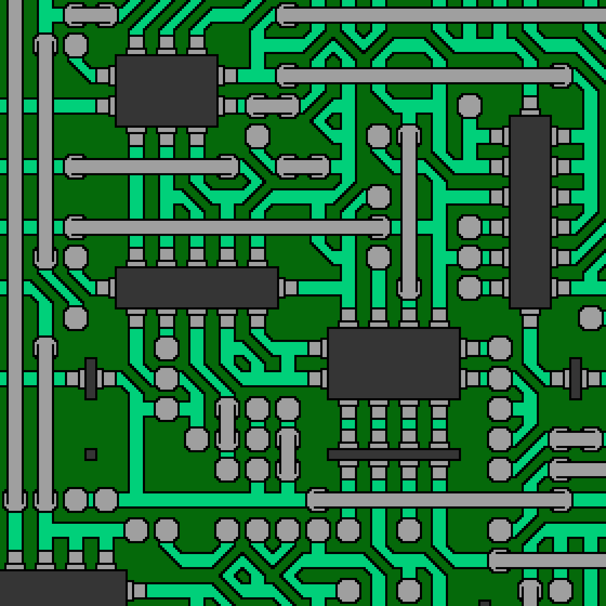

# wave-function-collapse
# Initial testing:

# The small boxes are representing a blank tile

# tests with more complicated tile sheets after adding dynamic rules

# addition of asymmetric tiles

# proof of concept dungeon layout
could be used for The-Lost-Dungeon-4?
